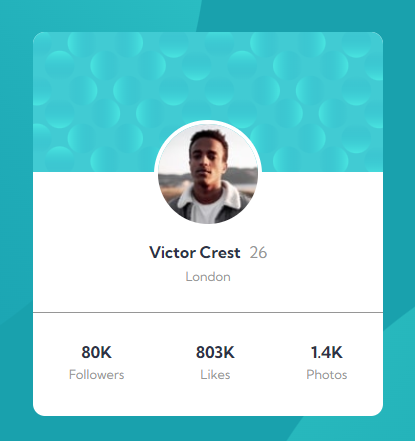

# Frontend Mentor - Profile card component solution

This is a solution to the [Profile card component challenge on Frontend Mentor](https://www.frontendmentor.io/challenges/profile-card-component-cfArpWshJ). Frontend Mentor challenges help you improve your coding skills by building realistic projects. 

## Table of contents

- [Overview](#overview)
  - [The challenge](#the-challenge)
  - [Screenshot](#screenshot)
  - [Links](#links)
- [My process](#my-process)
  - [Built with](#built-with)
  - [What I learned](#what-i-learned)


## Overview

### The challenge

- Build out the project to the designs provided

### Screenshot



### Links

- Solution URL: [Add solution URL here](https://github.com/BMcdavitt/femProfileCard)
- Live Site URL: [Add live site URL here](https://your-live-site-url.com)

## My process

### Built with

- Semantic HTML5 markup
- CSS custom properties
- Flexbox
- Mobile-first workflow

### What I learned

Aligning the two images onto the background was interesting.  I was researching ways of cropping the images to but the solution I came up with was to simply set overflorw to hidden on the background.


```css
body {
  overflow: hidden;
}

.topBackgroundImage {
  position: absolute;
  right: 50%;
  bottom: 25%;
}

.bottomBackgroundImage {
    position: absolute;
    left: 50%;
    top: 50%;
}
```

